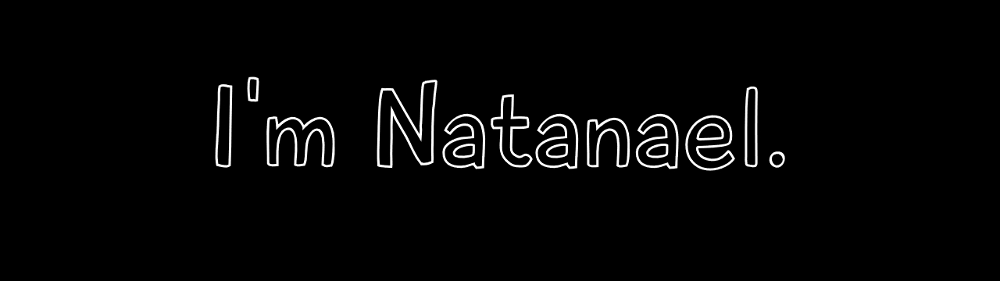

  
# Hey,

  

  
# About me
  

  

&nbsp;&nbsp;&nbsp;&nbsp;Hi. I'm Natanael - as you can tell - and that's my Github page. I'm 19 years old and I started to study computer science during the pandemic, in the middle of 2020. At first, I just wanted to learn what I had to in order to develop my very own games, so I began a Java course. I had zero background on coding at the time, so I gave up of learning it as a primary language, which took me to a friendlier environment for newbies like me: Web development. I learned the basics of HTML, CSS and JavaScript, but I still felt like needing a better comprehension of what programming was, so I ended up falling on CS50, where I could acquire the fundamental understanding that I was searching for. Now, I'm closer to web than game development and I actually love it. I know I'm young enough, so I want to enjoy the time I have for shooting different directions and see what I can get.

  
# 🌱 What I'm currently learning
I just got a Web Full-Stack scholarship, so I'll be learning these technologies:
  
  
  
  
 
  

  
# Links
  

  

<!--
**TheNatas/TheNatas** is a ✨ _special_ ✨ repository because its `README.md` (this file) appears on your GitHub profile.

Here are some ideas to get you started:

- 🔭 I’m currently working on ...
- 🌱 I’m currently learning ...
- 👯 I’m looking to collaborate on ...
- 🤔 I’m looking for help with ...
- 💬 Ask me about ...
- 📫 How to reach me: ...
- 😄 Pronouns: ...
- ⚡ Fun fact: ...
-->

